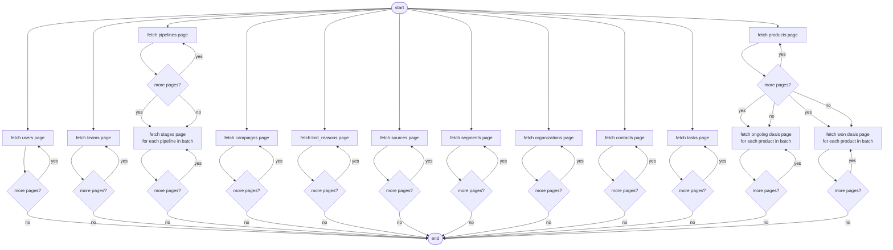

# improved-doodle

RD Station CRM worker for the **modest-galois** project. Fetches the full CRM graph from the RD Station v2 API, assembles it into domain objects via **fluffy-waddle**, and writes it to the sales schema in Postgres.

The sync strategy is a full replace every run: nuke the sales schema, repopulate from scratch. At ~2000 records this is faster than diffing.

## Full flow

```
RD Station API
  ↓ src/script/deals_fetcher/   (async, concurrent)
raw dicts
  ↓ fetched_deals_assembler.py
list[CRMDeal]
  ↓ src/script/deals_repository/   (DELETE → INSERT, one transaction)
Postgres sales.*
  ↓ selected_deals_assembler.py
list[CRMDeal]
```

`src/script/__main__.py` is the entrypoint. In local dev run with `python -m src.script`; in the Docker image, `COPY ./src ./` flattens the layout so it becomes `python -m script` (set by the k8s manifest). It calls `fetch_deals()` to run the fetch and assembly, then writes the resulting `list[CRMDeal]` to Postgres via `DealsRepository.update()`.

## Module layout

```
src/script/
  __main__.py                        entrypoint
  deals_fetcher/
    main.py                          fetch_deals() → list[CRMDeal]
    fetched_deals_assembler.py       raw API dicts → list[CRMDeal]
    fetch_pipelines_maker.py         async pipeline + stage fetcher
    fetch_products_maker.py          async product + deal fetcher, builds deal_products bridge
    fetch_deals_by_product_maker.py  ongoing + won deals per product, cutoff at the start of the same month one year back
    fetch_pipeline_stages_by_pipeline_maker.py
    fetcher.py                       Fetcher type alias
    tokens_repository.py             read/write tokens table
    tokens_rotator.py                OAuth2 refresh token flow
    helpers/
      httpx_fetch_maker.py           wraps httpx.AsyncClient as Fetcher
      paginated_fetch_maker.py       generic pagination over page[number]/page[size]
  deals_repository/
    main.py                          DealsRepository — .update(deals) and .get()
    deleter.py                       DELETE from all sales.* tables
    inserters.py                     insert_* per table, ON CONFLICT DO NOTHING
    selectors.py                     select_* per table
    selected_deals_assembler.py      DB rows → list[CRMDeal]
```

## Fetch flow



ISO 5807 convention: multiple lines leaving a symbol all fire in parallel. Every chain drains independently to `end`.

## Runtime

The worker reads the following from the environment:

| Variable | Source | Purpose |
|---|---|---|
| `CRM_CLIENT_ID` | k8s secret | OAuth2 app client ID |
| `CRM_CLIENT_SECRET` | k8s secret | OAuth2 app client secret |
| `PGHOST` / `PGPORT` / `PGUSER` / `PGPASSWORD` / `PGDATABASE` | k8s secret | Postgres connection |

`access_token` and `refresh_token` are read from and written back to the `tokens` table (`provider = 'rd_station'`).

## Development

Start the compose stack (Postgres + migrations + app shell):

```sh
docker compose up -d
```

Exec into the app container and install dependencies:

```sh
docker compose exec app bash
cd /root/app
. scripts/install-dependencies.sh
```

Run the full roundtrip test (requires the compose DB to be up and migrated):

```sh
. ~/.venv/bin/activate
python -m pip install pytest
pytest tests/test_roundtrip.py
```

The roundtrip test mock-fetches from `tests/data/*.json`, assembles `list[CRMDeal]`, writes to the live DB via `DealsRepository.update()`, reads back via `DealsRepository.get()`, and asserts the returned deals match the inserted deals across their serialized fields.

## Deployment

Pushing a `v*.*.*` tag triggers the `deployment` workflow, which builds a multi-arch Docker image (`linux/amd64`, `linux/arm64`) and pushes it to Docker Hub via the shared [fuzzy-garbanzo](https://github.com/hcubasd/fuzzy-garbanzo) workflow. Requires `DOCKERHUB_USERNAME` and `DOCKERHUB_TOKEN` set as repository secrets.

## Scripts

- `scripts/config-helix.sh` — configures the Helix editor for this project's stack
- `scripts/install-dependencies.sh` — creates a venv at `~/.venv` and installs production dependencies
- `scripts/integrate.sh` — installs dependencies, adds pytest, and runs the test suite
