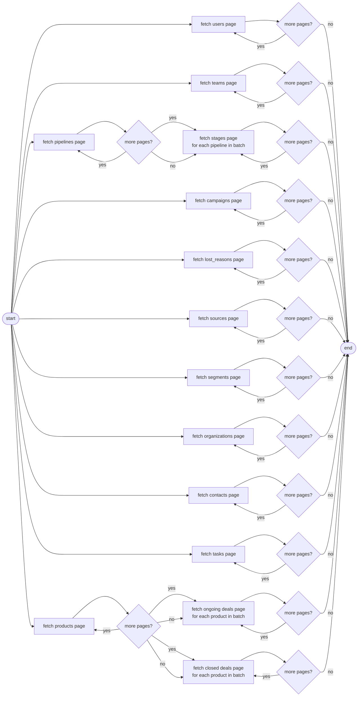

# improved-doodle

RD Station CRM worker for the **modest-galois** project. Fetches the full CRM graph from the RD Station v2 API, builds the domain model via **fluffy-waddle**, and writes it to the sales schema in Postgres.

The sync strategy is a full replace every run: nuke the sales schema, repopulate from scratch. At ~2000 records this is faster than diffing.

## Fetch flow

ISO 5807 convention: multiple lines leaving a symbol all fire in parallel. Every chain drains independently to `end`.

## Runtime

The worker reads the following from the environment:

| Variable | Source | Purpose |
|---|---|---|
| `RDS_CLIENT_ID` | k8s secret | OAuth2 app client ID |
| `RDS_CLIENT_SECRET` | k8s secret | OAuth2 app client secret |
| `PGHOST` / `PGPORT` / `PGUSER` / `PGPASSWORD` / `PGDATABASE` | k8s secret | Postgres connection |

`access_token` and `refresh_token` are read from and written back to the `tokens` table (`provider = 'rdstation'`).

## Scripts

Helper scripts for setting up a development environment on a new machine:

- `scripts/config-helix.sh` — configures the Helix editor for this project's stack
- `scripts/install-requirements.sh` — installs Python dependencies and the package in editable mode
